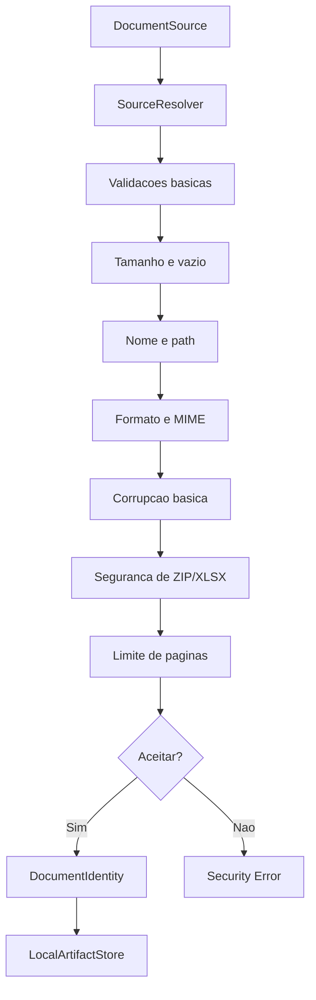

# Seguranca de Ingestao

A Fase 2.8 centraliza validacoes de seguranca antes de armazenar documentos,
criar jobs ou encaminhar conteudo para capabilities.

Documentos externos sao tratados como entradas nao confiaveis. Nome, extensao,
MIME declarado e tamanho informado sao sinais, nao fontes de autoridade.

## Fluxo

## Componentes

| Componente | Responsabilidade |
|---|---|
| `IngestionSecurityPolicy` | Politica configuravel por instancia |
| `IngestionLimits` | Limites numericos com unidades explicitas |
| `LocalSourceResolver` | Limites baratos e copia controlada de streams |
| `DocumentSecurityValidator` | Decisao central de aceitacao/rejeicao |
| `ArchiveSecurityValidator` | Validacao limitada de ZIP/XLSX |
| `FilenameSanitizer` | Nome seguro como metadado |
| `Sha256ContentHasher` | Hash com limite real durante leitura |
| `LocalArtifactStore` | Storage key confinada ao diretorio base |

## Ordem Das Validacoes

1. Resolver fonte local, bytes ou stream.
2. Validar tamanho conhecido.
3. Rejeitar vazio.
4. Ler amostra com timeout.
5. Detectar formato real.
6. Sanitizar nome.
7. Validar formato permitido.
8. Validar MIME declarado conforme politica.
9. Validar extensao conforme politica.
10. Executar checagem estrutural minima.
11. Validar ZIP/XLSX quando aplicavel.
12. Aplicar limite de paginas quando conhecido.
13. Calcular hash com limite real de leitura.
14. Somente entao gravar artefato e documento.

## Matriz De Formatos

| Formato | MIME canonico | Extensoes | Deteccao | Divergencia |
|---|---|---|---|---|
| PDF | `application/pdf` | `.pdf` | assinatura `%PDF-` | warning ou erro se `require_mime_match=True` |
| XLSX | `application/vnd.openxmlformats-officedocument.spreadsheetml.sheet` | `.xlsx` | ZIP + OOXML minimo | warning ou erro conforme politica |
| CSV | `text/csv` | `.csv` | heuristica textual conservadora | warning ou erro conforme politica |
| PNG | `image/png` | `.png` | assinatura PNG | warning ou erro conforme politica |
| JPEG | `image/jpeg` | `.jpg`, `.jpeg` | assinatura JPEG | warning ou erro conforme politica |
| TIFF | `image/tiff` | `.tif`, `.tiff` | assinatura TIFF | warning ou erro conforme politica |

Formato `unknown`, executavel disfarcado e ZIP generico sao rejeitados.

## Arquivos Compactados

XLSX e tratado como ZIP antes de qualquer parsing de planilha.

Validacoes atuais:

- quantidade de entradas;
- tamanho descomprimido total declarado;
- tamanho individual declarado;
- razao de compressao;
- entradas criptografadas;
- nomes internos com path traversal;
- estrutura OOXML minima;
- leitura limitada de entradas essenciais.

ZIP generico nao e formato publico aceito nesta fase.

## Nomes E Caminhos

O filename e preservado apenas como metadado sanitizado. Ele nao controla:

- storage key;
- diretorio;
- arquivo temporario definitivo;
- identificador de artefato;
- caminho de documento.

`LocalArtifactStore` gera storage keys por hash e valida que qualquer referencia
recebida permanece dentro de `<data_directory>/artifacts`.

## Limites Atuais

Os limites padrao estao descritos em
[ingestion-limits.md](../specifications/ingestion-limits.md).

Esta fase nao implementa antivirus, sandbox completo, OCR, parser profundo de
PDF/Excel, isolamento de processo ou quotas multi-tenant.
