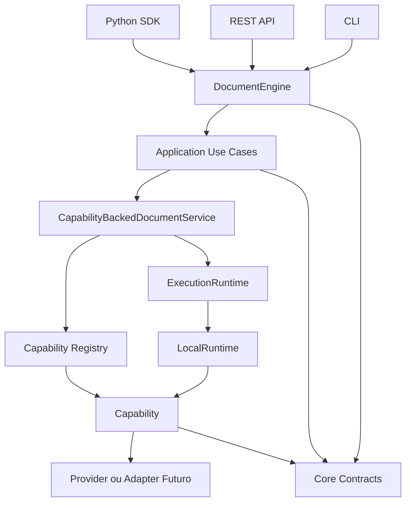

# Kernel v0

Kernel v0 e a fronteira logica minima do Eixo apos a CLI inicial e antes dos
testes completos de paridade.

Nao existe um pacote fisico chamado `kernel`. O kernel atual e composto por
pacotes pequenos, cada um com uma responsabilidade verificavel.

## Definicao

Kernel v0 e o conjunto de contratos, fachada, casos de uso, registry,
capabilities, runtime local e artefatos que permite executar um fluxo
documental sem depender de API, CLI, FastAPI, PostgreSQL, Redis, MinIO,
Temporal ou providers concretos.

## Pacotes

| Pacote | Responsabilidade | Dependencias atuais | Estado |
| --- | --- | --- | --- |
| `document-core` | tipos fundamentais, ids, contratos, erros, warnings, serializacao | biblioteca padrao | implementado |
| `document-model` | espaco reservado para modelo documental canonico | nenhuma relevante | placeholder intencional |
| `artifacts` | reexport inicial de referencias de artefato | `document-core` | minimo |
| `plugins` | contratos de capability, provider, registry e runtime | `document-core` | implementado |
| `runtime-local` | execucao local async/thread/process, timeout, progresso e cancelamento | `document-core`, `plugins` | implementado |
| `document-application` | casos de uso e servicos de aplicacao | `document-core`, `plugins` | implementado |
| `document-engine` | fachada publica e composition root local | `document-core`, `plugins`, `runtime-local`, `document-application` | implementado |

Consumidores fora do kernel:

| Consumidor | Papel |
| --- | --- |
| `document-sdk-python` | importa e reexporta a API publica Python |
| `apps/api` | adapta HTTP para contratos e `DocumentEngine` |
| `apps/cli` | adapta argumentos de terminal para contratos e `DocumentEngine` |

## Fronteiras

Pertence ao Kernel v0:

- `DocumentSource`;
- `LocalPathSource`, `BytesSource`, `StreamSource` e `ArtifactReferenceSource`;
- `DetectedDocumentFormat`, `ContentHash`, `ContentMetadata` e `DocumentIdentity`;
- `InspectionRequest` e `InspectionResult`;
- `ParseRequest` e `ParseResult`;
- `ProcessingRequest` e `ProcessingResult`;
- `JobResult`;
- `ErrorResult`;
- `ExecutionContext`;
- `ExecutionTask` e `ExecutionResult`;
- `ExecutionRuntime`;
- `CapabilityDescriptor`;
- `ProviderDescriptor`;
- `CapabilityRegistry`;
- `LocalRuntime`;
- erros, warnings, progresso, cancelamento, timeout e metadados.

Fica fora do Kernel v0:

- transporte HTTP;
- comandos de terminal;
- modelos especificos de API;
- persistencia duravel;
- object storage;
- workers distribuidos;
- parsers concretos;
- OCR;
- autenticacao;
- billing;
- UI.

## Direcao De Dependencias

```text
SDK/API/CLI
  -> DocumentEngine
  -> document-application
  -> plugins
  -> document-core

DocumentEngine
  -> runtime-local

runtime-local
  -> plugins
  -> document-core
```

Dependencias proibidas e cobertas por testes:

- `document-core` nao importa apps ou adapters;
- `document-application` nao importa FastAPI, CLI, Typer ou Click;
- `document-engine` nao importa FastAPI, CLI, parsers, Redis, MinIO ou Temporal;
- `runtime-local` nao importa API ou CLI;
- SDK nao depende da CLI;
- API e CLI nao implementam parsers concretos.

## Fluxo Local



Fluxo minimo:

```text
receber contrato
  -> adaptar entrada publica para DocumentSource, quando necessario
  -> resolver fonte
  -> detectar formato real
  -> calcular hash e identidade de conteudo
  -> criar ExecutionContext
  -> resolver capability por contrato, MIME canonico e formato detectado
  -> criar ExecutionTask
  -> executar via LocalRuntime
  -> converter falha para erro tipado
  -> retornar resultado publico
```

## Capability Registry

O registry suporta:

- registrar providers;
- registrar capabilities;
- buscar por id;
- buscar por formato;
- buscar por contratos de entrada e saida;
- resolver capability compativel;
- detectar duplicidade;
- detectar ausencia;
- detectar ambiguidade por prioridade;
- listar capabilities e providers.

`CapabilityDescriptor` declara:

- `capability_id`;
- `name`;
- `description`;
- `version`;
- `input_contract`;
- `output_contract`;
- formatos e MIME suportados;
- `resource_class`;
- `deterministic`;
- `supports_cancellation`;
- `supports_progress`;
- provider, status, prioridade e metadata.

Campos vazios de formato ou MIME significam compatibilidade generica para esse
eixo de resolucao. Quando preenchidos, a resolucao exige correspondencia.

## Runtime Local

`LocalRuntime` implementa `ExecutionRuntime` com:

- execucao async;
- execucao em thread;
- execucao em processo para handlers serializaveis;
- limite de concorrencia;
- timeout;
- cancelamento cooperativo;
- progresso;
- contexto por tarefa;
- resultados tipados;
- shutdown idempotente.

Ele nao escolhe capabilities, nao faz parsing e nao contem regra documental.

## Jobs

`InMemoryJobService` e a implementacao local inicial de jobs.

Caracteristicas:

- cria `JobResult`;
- executa `ProcessingRequest` pelo runtime;
- armazena status e resultado em memoria;
- protege estado mutavel com lock async;
- permite cancelamento idempotente quando ja cancelado;
- rejeita cancelamento de job concluido;
- perde dados ao reiniciar o processo.

Persistencia duravel fica fora do Kernel v0.

## Erros

Erros publicos derivam de `EixoError` e carregam:

- `code`;
- `message`;
- `category`;
- `retryable`;
- `details`;
- `public_context`;
- `cause` interna.

Transportes convertem esses erros para suas representacoes:

- API retorna `ErrorResult` e HTTP status;
- CLI retorna mensagem em `stderr` e codigo de saida;
- SDK propaga excecoes de dominio.

Stack traces nao fazem parte do contrato publico.

## Cancelamento, Timeout E Progresso

Cancelamento e cooperativo por `CancellationToken`.

Timeout e aplicado pelo runtime usando `ExecutionOptions`, timeout da tarefa ou
timeout padrao do runtime.

Progresso e publicado por `ProgressReporter` e exposto no handle local.

Capabilities podem declarar suporte a progresso e cancelamento no descriptor,
sem obrigar todas as capabilities a implementar esses recursos.

## Relacao Com SDK, API E CLI

O SDK reexporta `DocumentEngine` e contratos publicos.

A API converte:

```text
HTTP -> contrato -> DocumentEngine -> JSON/HTTP
```

A CLI converte:

```text
argumentos -> contrato -> DocumentEngine -> console/JSON
```

Nenhum desses canais deve implementar regras documentais ou resolver stores
diretamente.

## Ingestao Inicial

As fases 2.1 a 2.4 adicionam o fluxo compartilhado de ingestao e identidade de
conteudo. A documentacao detalhada esta em
[ingestion-and-content-identity.md](ingestion-and-content-identity.md).

Regras principais:

- `DocumentSource` descreve origem, mas nao abre arquivo;
- `SourceResolver` controla abertura, stream e cleanup;
- deteccao nao confia apenas em extensao ou MIME declarado;
- SHA-256 e calculado sobre bytes reais em chunks;
- `DocumentId` nao e igual ao hash e continua reservado para persistencia futura.

## Diagnostico Do Estado Atual

Implementado:

- contratos publicos fundamentais;
- registry funcional;
- runtime local;
- casos de uso;
- engine local;
- SDK publico;
- API REST inicial;
- CLI inicial;
- testes de arquitetura, runtime, engine, API, CLI e kernel.

Incompleto por desenho:

- modelo canonico rico;
- artefatos reais;
- providers documentais concretos;
- persistencia duravel de jobs;
- runtime distribuido;
- paridade completa automatizada entre canais.

## Extensoes Previstas

Proximas evolucoes naturais:

- Fase 1.11: paridade formal SDK/API/CLI;
- providers reais de inspecao e parsing;
- contratos de artefatos mais ricos;
- modelo canonico;
- persistencia substituivel;
- runtime distribuido futuro.
