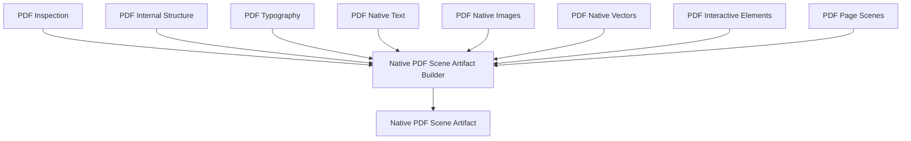

# Native PDF Scene Artifact

Status: inicial, Fase 3.11.

`NativePDFSceneArtifact` e o artefato nativo final do Bloco 3. Ele consolida a
decomposicao de PDF em uma unidade versionada, rastreavel e serializavel, sem
reabrir o PDF e sem reexecutar extratores.

## Estrutura

O artefato raiz preserva:

- identificacao, versao do artefato e versao de schema;
- referencia ao documento original e hash de entrada;
- resumo de providers;
- inspecao tecnica opcional;
- referencia ao catalogo de recursos;
- cenas por pagina;
- referencias para texto, imagens, vetores, interativos e fontes;
- resumo de fidelidade;
- resumo de editabilidade preliminar;
- warnings e limitacoes consolidadas;
- estatisticas globais;
- proveniencia da consolidacao.

## Politica De Dados

O artefato referencia dados grandes em vez de duplica-los:

- bytes de imagem ficam nos artefatos de imagem ou no `ArtifactStore`;
- programas de fonte ficam em referencias proprias;
- objetos concretos do provider nao aparecem;
- streams originais nao sao copiados para a raiz.

## Builder

`NativePDFSceneArtifactBuilder` consome artefatos ja produzidos. Ele valida
compatibilidade de `document_id` e hash, consolida referencias, agrega
estatisticas, deduplica warnings, normaliza limitacoes e calcula resumos de
fidelidade e editabilidade.

Integracao publica, jobs e armazenamento automatico pertencem a Fase 3.12.
