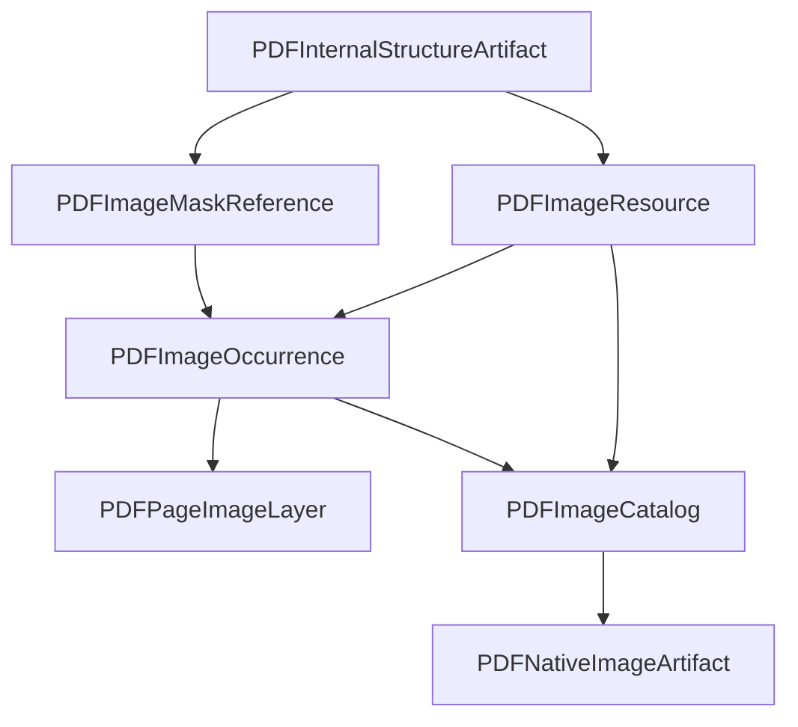

# PDF Images

Status: Fase 3.7 implementada parcialmente.

## Finalidade

A decomposicao de imagens em PDF separa recurso nativo, ocorrencia visual e
artefatos binarios. A mesma imagem pode ser declarada uma vez no PDF e pintada
varias vezes em paginas, tamanhos, transformacoes ou mascaras diferentes.

## Modelo

`PDFImageResource` descreve a imagem como recurso reutilizavel: origem no objeto
PDF, dimensoes, bits por componente, color space, filtros, hashes e referencias
para bytes extraidos quando o provider permitir.

`PDFImageOccurrence` descreve cada uso visual: pagina, recurso usado, bounding
box, quad, matriz de transformacao, ordem de pintura, visibilidade, opacidade,
mascara efetiva e DPI estimado.

`PDFPageImageLayer` agrupa ocorrencias por pagina. `PDFImageCatalog` permite
consultar recursos, ocorrencias, mascaras, reutilizacao e lacunas.

## Fronteiras

- bytes grandes nao entram no JSON publico;
- objetos concretos do provider nao atravessam `eixo.pdf`;
- recurso de imagem nao e ocorrencia visual;
- mascara e soft mask sao referencias tecnicas, nao imagens visuais
  independentes por padrao;
- rasterizacao de pagina inteira nao faz parte desta fase.

## Provider PyMuPDF

O adapter usa `page.get_images(full=True)` para recursos, `smask` para soft
masks, `document.extract_image(xref)` para bytes codificados quando disponivel
e `page.get_image_info(xrefs=True)` para ocorrencias. Ordem, clipping,
inline images e Form XObjects aninhados permanecem best effort.

Detalhes dos contratos estao em
[pdf-image-resources.md](../specifications/pdf-image-resources.md),
[pdf-image-masks.md](../specifications/pdf-image-masks.md) e
[pdf-image-transforms.md](../specifications/pdf-image-transforms.md).
