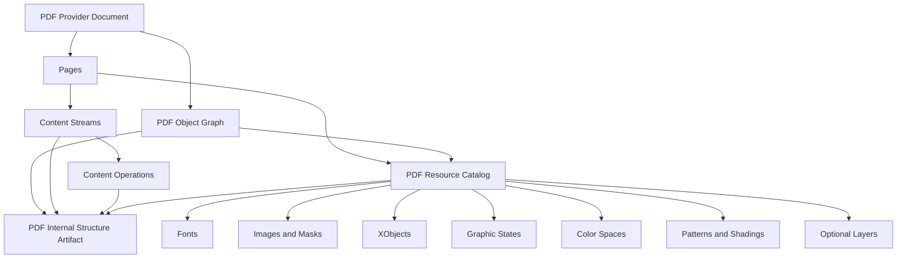

# PDF Object Model

Status: Fase 3.4 implementada.

## Finalidade

A Fase 3.4 cria o inventario tecnico interno do PDF. O resultado e um artefato
versionado e serializavel que preserva objetos, referencias, paginas, content
streams, recursos e relacoes sem expor objetos vivos do provider.

Fluxo:



## Contratos

Os contratos publicos ficam em `eixo.pdf`:

- `PDFObjectReference`;
- `PDFPageReference`;
- `PDFResourceReference`;
- `PDFContentStreamReference`;
- `PDFOperationReference`;
- `PDFIndirectObject`;
- `PDFObjectGraph`;
- `PDFObjectRelation`;
- `PDFContentStream`;
- `PDFContentOperation`;
- `PDFResourceCatalog`;
- `PDFInternalPageMap`;
- `PDFInternalStructureArtifact`;
- `PDFInternalMappingOptions`;
- `DefaultPDFInternalStructureMapper`.

IDs sao deterministicas quando ha referencia nativa estavel:

```text
pdfobj:42:0
pdfstream:42:0
pdffont:pdfobj:18:0
pdfimage:pdfobj:53:0
pdfop:page-1:stream-0:operation-45
```

Quando um recurso nao possui xref, o ID inclui tipo, escopo, pagina, pai e nome
do recurso. IDs nunca dependem de memoria.

## Grafo

`PDFObjectGraph` contem:

- objetos indiretos;
- relacoes tipadas;
- referencias nao resolvidas;
- ciclos detectados.

Relacoes suportadas:

- `references`;
- `contains`;
- `used_by`;
- `defined_in`;
- `inherits_from`;
- `draws`;
- `uses_resource`;
- `masked_by`;
- `belongs_to_layer`;
- `parent_form`.

O grafo permite recursos compartilhados sem duplicar a definicao do recurso.

## Limites

Esta fase nao interpreta glifos, palavras, imagens finais, vetores, clipping
completo, links, anotacoes, formularios ou semantica documental. Ela preserva a
estrutura tecnica que essas fases consumirao.
