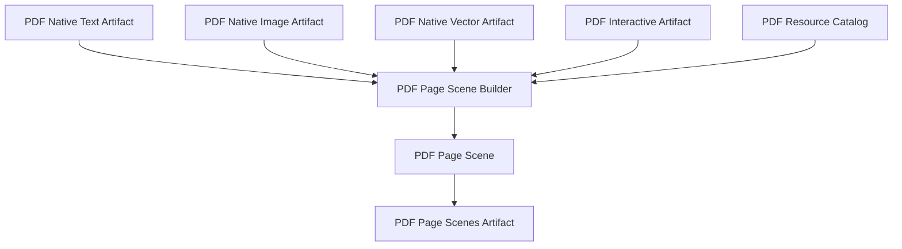

# PDF Page Scene

Status: inicial, Fase 3.10.

`PDFPageScene` consolida os artefatos nativos de PDF em uma cena visual por
pagina, independente do provider. A cena nao reabre o PDF e nao reextrai texto,
imagens, vetores ou elementos interativos.

## Contratos

- `PDFVisualElement`: referencia visual leve para texto, imagem, vetor,
  clipping, link, anotacao ou widget.
- `PDFPageScene`: cena de uma pagina com geometria, elementos, ordem, relacoes,
  recursos, warnings e estatisticas.
- `PDFPageScenesArtifact`: artefato intermediario versionado com as cenas por
  pagina.
- `PDFPageSceneBuilder`: monta cenas a partir de artefatos anteriores e
  `PageGeometry`.

## Politica

A cena usa referencias para os artefatos de origem, em vez de duplicar bytes de
imagem, programas de fonte, objetos internos do provider ou streams completos.

Elementos com ordem de pintura ou ordem nativa confiavel entram em
`ordered_element_ids`. Links logicos, anotacoes e widgets sao preservados como
elementos visuais/logicos, mas nao sao inseridos arbitrariamente na ordem de
pintura quando nao possuem appearance materializada.

## Limitacoes

- A geometria canonica completa deve ser fornecida ao builder por `page_id`.
- A cena nao promete editabilidade; ela registra apenas `editability_hint`.
- Aparencias de anotacoes e formularios ainda nao sao materializadas como
  subcenas.
- `PDFPageScenesArtifact` prepara a Fase 3.11, mas ainda nao e o
  `NativePDFSceneArtifact` final.
