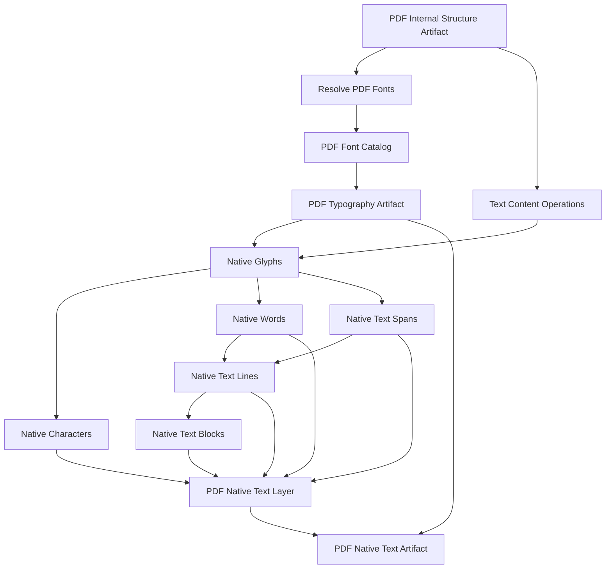

# PDF Typography

Status: Fases 3.5 e 3.6 implementadas parcialmente.

## Finalidade

A camada tipografica separa recurso de fonte, programa incorporado e estilo de
ocorrencia textual. `PDFFontResource` descreve a fonte no PDF; `PDFTextStyle`
descreve como uma ocorrencia foi desenhada.

## Contratos

- `PDFFontResource`
- `PDFFontProgramReference`
- `PDFEncoding`
- `PDFCMapReference`
- `PDFUnicodeMapping`
- `PDFGlyphMapping`
- `PDFTextColor`
- `PDFTextStyle`
- `PDFFontUsage`
- `PDFFontCatalog`
- `PDFTypographyArtifact`
- `PDFTypographyOptions`

## Regras

- Tamanho, cor, opacidade, render mode e transformacoes pertencem a
  `PDFTextStyle`, nao a `PDFFontResource`.
- Fontes subset preservam `subset_prefix`, `internal_font_name` e
  `normalized_family`.
- Fontes incorporadas sao referenciadas com `PDFFontProgramReference`; bytes nao
  sao embutidos no JSON principal.
- Unicode, glyph id, CID e char code sao campos distintos e opcionais.
- Toda resolucao possui origem, confianca ou limitacao explicita.

## Limites Atuais

O provider PyMuPDF deriva fontes de `page.get_fonts(full=True)` e texto de
`page.get_text("rawdict")`. A fase nao decodifica programas de fonte, CMaps
completos, `ToUnicode` completo ou operadores textuais brutos.
